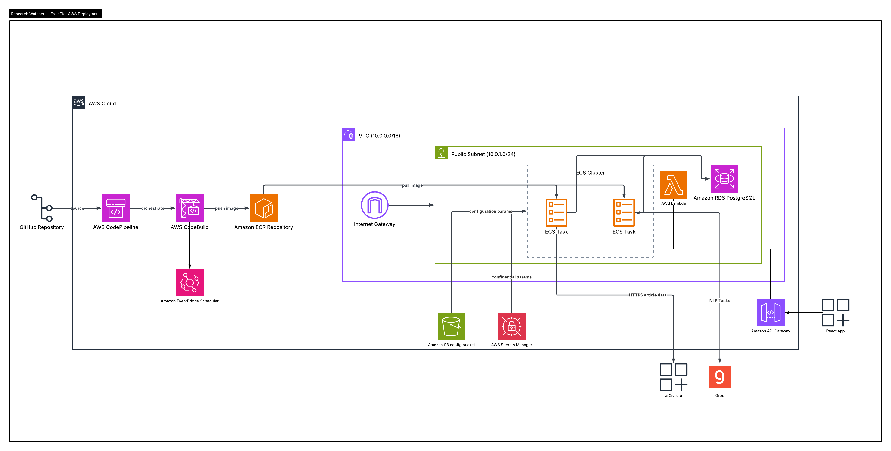

# Terraform HCL code for Research watcher infrastructure

# organization

- main - buckets
- ecs - cluster and tasks and roles
- cicd - codepipeline and codebuild
- api - lambda and api gateway 
- database - database, secret
- network - vpc,subnets, security group

## steps

Need AWS CLI and a profile with access keys setup in system since that is how provider is set up
1. install terraform
2. terraform init
3. terraform validate
4. terraform apply

To delete the entire infrastructure

terraform destroy

## Architecture

